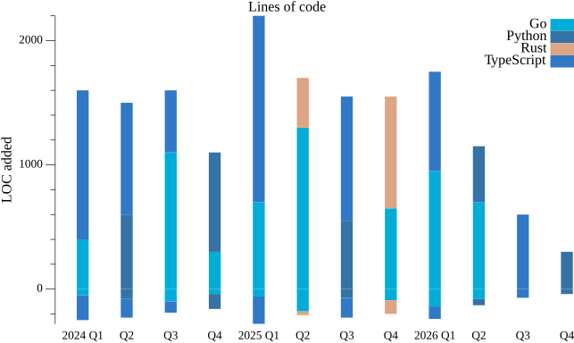

<!-- Illustrative sanitized sample — not live account data -->


**I'm an Early 🐤**

```text
🌞 Morning                55 commits          █████████░░░░░░░░░░░░░░░░   36.67 %
🌆 Daytime                40 commits          ███████░░░░░░░░░░░░░░░░░░   26.67 %
🌃 Evening                30 commits          █████░░░░░░░░░░░░░░░░░░░░   20.00 %
🌙 Night                  25 commits          ████░░░░░░░░░░░░░░░░░░░░░   16.67 %
```

📅 **I'm Most Productive on Tuesday**

```text
Monday                   20 commits          ███░░░░░░░░░░░░░░░░░░░░░░   13.33 %
Tuesday                  40 commits          ███████░░░░░░░░░░░░░░░░░░   26.67 %
Wednesday                25 commits          ████░░░░░░░░░░░░░░░░░░░░░   16.67 %
Thursday                 22 commits          ████░░░░░░░░░░░░░░░░░░░░░   14.67 %
Friday                   18 commits          ███░░░░░░░░░░░░░░░░░░░░░░   12.00 %
Saturday                 15 commits          ███░░░░░░░░░░░░░░░░░░░░░░   10.00 %
Sunday                   10 commits          ██░░░░░░░░░░░░░░░░░░░░░░░   06.67 %
```

📊 **This Week I Spent My Time On**

```text
🕑︎ Time Zone: UTC

💬 Programming Languages:
Python                   25 hrs 40 mins      ████████████░░░░░░░░░░░░░   48.64 %
Markdown                 15 hrs 46 mins      ███████░░░░░░░░░░░░░░░░░░   29.89 %
YAML                     8 hrs 2 mins        ████░░░░░░░░░░░░░░░░░░░░░   15.25 %
```

🤖 **AI Coding This Week**

```text
⏱ AI Coding Time: 1 hr 53 mins (3.59%)

✍️ 1,245 lines written by AI, 3,120 lines written by hand (28.52% AI-written)

🔤 845,000 Input Tokens, 21,000 Output Tokens

💵 $12.48 Estimated AI Cost This Week

🧠 5 AI Sessions, 20 AI Prompts

Sonnet                   1,200 lines         ██████████████████████░░░   89.96 %
GPT-4                    134 lines           ███░░░░░░░░░░░░░░░░░░░░░░   10.04 %

🔎 AI Coding Insights:
🧑‍💻 Mostly Hands-On — 28.52% of written lines came from AI
📄 Detailed Prompter — average 925 characters per prompt
🔁 Iterative Prompter — average 4.0 prompts per session
🔍 Hands-On Reviewer — 73.29% of changed lines were hand-edited
```

**Timeline**



Last Updated on 01/01/2026 12:00:00 UTC
